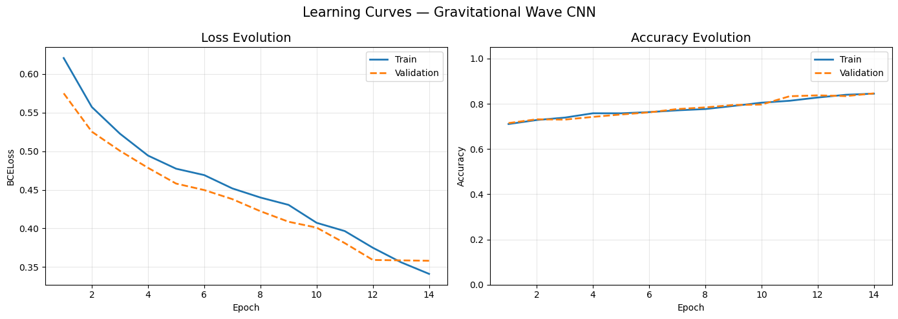
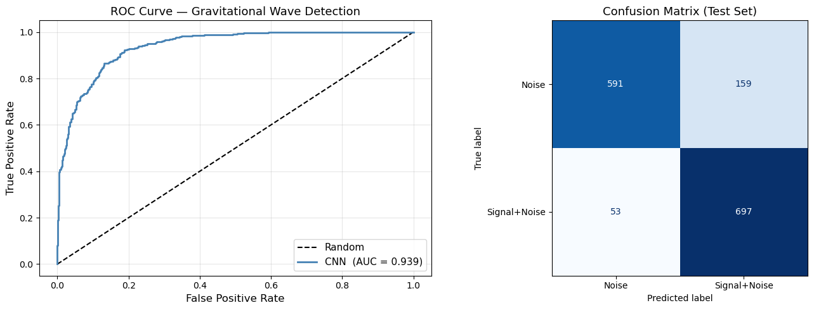
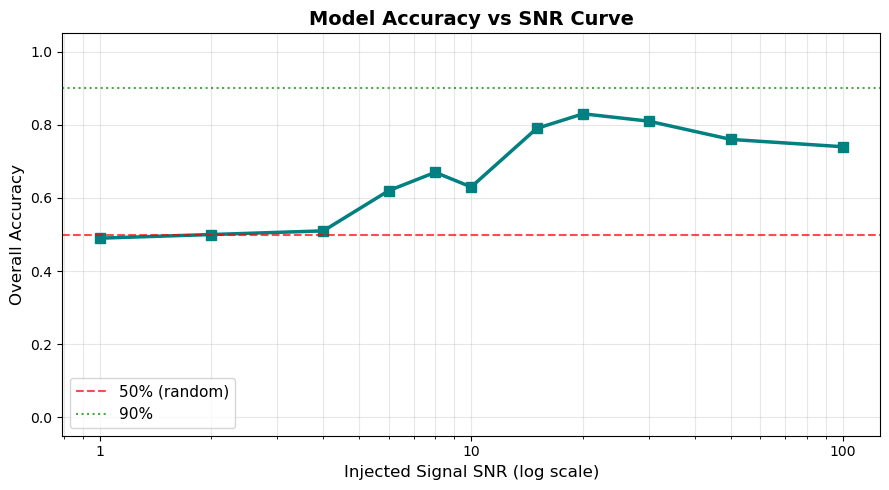

# 🌌 Gravitational Wave Signal Classification with CNN

Deep learning approach for gravitational-wave signal detection using a
**Convolutional Neural Network (CNN)** trained on time-frequency spectrograms
of simulated detector data.

## Overview

This project investigates the use of deep learning for identifying
gravitational-wave signals embedded in noisy detector data.

A convolutional neural network is trained to perform binary classification
between:

* **Noise** — detector noise, including simulated transient glitches.
* **Signal + Noise** — gravitational-wave signals injected into detector noise.

The project follows a complete end-to-end pipeline, from physical waveform
generation and detector-noise simulation to spectrogram construction, CNN
training, performance evaluation, SNR-dependent sensitivity studies,
out-of-distribution generalization tests, and comparison with matched
filtering.

When PyCBC is available, physical gravitational-wave waveforms are generated
using waveform models such as **IMRPhenomD** and **TaylorT4**. A synthetic
chirp implementation is provided as a fallback when PyCBC is unavailable.

## Dataset

The dataset is generated programmatically rather than loaded from an
external database.

A total of **10,000 samples** are generated for the main dataset, containing
both noise-only and signal-plus-noise examples. The dataset is split into:

Training:    70%
Validation:  15%
Test:        15%

The train/validation/test split is stratified and uses a fixed random seed for reproducibility.
The simulated detector data include:
Gaussian noise with variable amplitude;
transient sine-Gaussian glitches;
gravitational-wave signals with variable signal-to-noise ratio;
varying source distances;
varying low-frequency cutoffs;
different compact-object mass ranges;
aligned spin parameters.
The default sampling frequency is 2048 Hz, with signal windows between
1 and 2 seconds.
All input spectrograms are normalized using the mean and standard deviation
computed exclusively from the training set, which prevents information from
the validation and test sets from entering the training preprocessing.

## 🧠 Methodology

### 1. Gravitational-Wave Signal Generation

When PyCBC is available, physical gravitational-wave waveforms are generated
using parameterized compact-binary systems.
The default parameter ranges include:
Sampling frequency:       2048 Hz
Signal duration:          1–2 s
Signal SNR:               5–20
Distance:                 100–1000 Mpc
Low-frequency cutoff:     40–60 Hz
Aligned spin:             -0.8 to 0.8
The project supports different compact-object mass ranges corresponding to
binary neutron-star, binary black-hole, and neutron-star–black-hole systems.
When PyCBC is not available, the project falls back to synthetic quadratic
chirps generated with SciPy.

## 📊 Results

These results were obtained with n_samples = 10000.

Additional figures are included in the main code.

### Learning Curves

### ROC Curve and Confusion Matrix

### Accuracy vs SNR

## 🔬 Matched Filtering

The project also compares the CNN approach with matched filtering under
ideal and non-ideal conditions.

The comparison is intended to illustrate the different assumptions and
operating regimes of the two approaches rather than establish a perfectly
fair benchmark.

## 🛠️ Requirements

- Python 3
- NumPy
- SciPy
- Matplotlib
- Seaborn
- Scikit-learn
- PyTorch
- Torchvision
- PyCBC
- LALSuite
